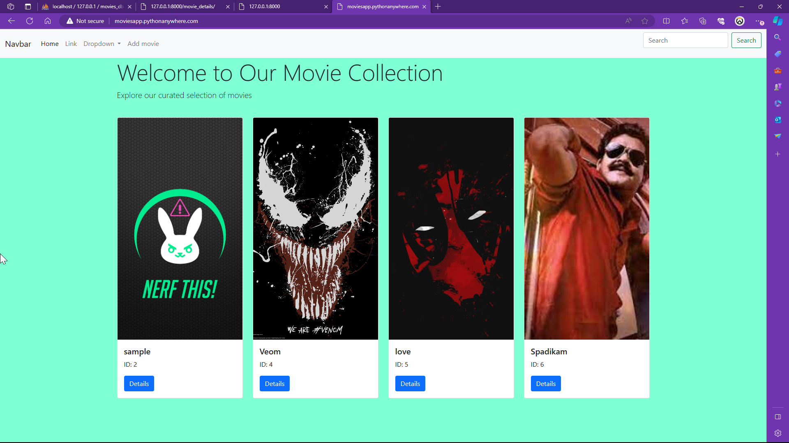

# Django Simple E-Commerce Website (Mini Movies website)
This is a simple e-commerce website built with Django,Python,HTML,CSS,Bootstrap & Javascript 
Project Title
Movie Catalog Management System (MCMS)

Overview
MCMS is a web-based application developed using Django framework for managing a catalog of movies. 
It allows users to view a list of movies, add new movies to the catalog, update existing movie details, and delete movies from the catalog.

Key Features
View Movies: Users can view a list of movies in the catalog along with their details such as name, description, and release year.

Movie Details: Users can view detailed information about a specific movie, including its name, description, and release year.

Add Movie: Users can add new movies to the catalog by providing details such as name, description, release year, and an image.

Update Movie: Users can update existing movie details, including name, description, release year, and image.

Delete Movie: Users can delete movies from the catalog.
