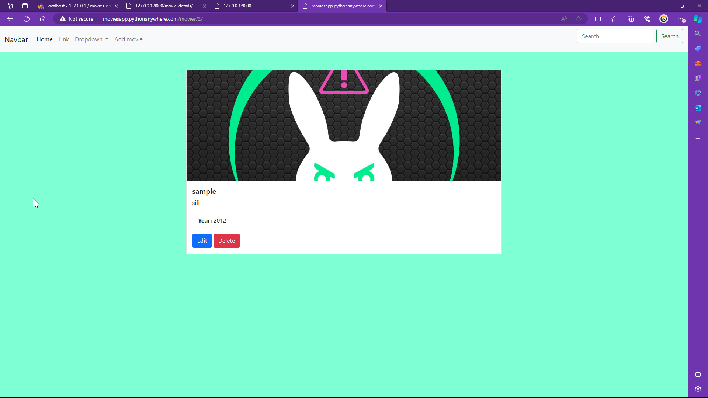
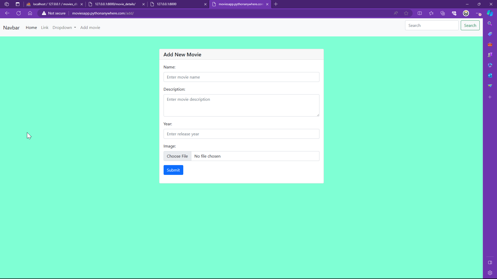

# Django Simple E-Commerce Website (Mini Movies website)
This is a simple e-commerce website built with Django,Python,HTML,CSS,Bootstrap & Javascript 
Project Title
# Movie Catalog Management System (MCMS)

http://moviesapp.pythonanywhere.com/  (Valid until July 7, 2024.)

# Overview
MCMS is a web-based application developed using Django framework for managing a catalog of movies. 
It allows users to view a list of movies, add new movies to the catalog, update existing movie details, and delete movies from the catalog.

# Key Features
# View Movies:
Users can view a list of movies in the catalog along with their details such as name, description, and release year.

# Movie Details:
Users can view detailed information about a specific movie, including its name, description, and release year.

# Add Movie: 
Users can add new movies to the catalog by providing details such as name, description, release year, and an image.

# Update Movie:
Users can update existing movie details, including name, description, release year, and image.

# Delete Movie:
Users can delete movies from the catalog.

# Technologies Used

- Django
- HTML/CSS
- Django templates
- Bootstrap 

# Installation

# 1. Clone the repository:
   git clone https://github.com/yourusername/your-repository.git
   cd your-repository

# 2. Install dependencies:

pip install -r requirements.txt

# 3. Set up the database:

python manage.py migrate

# 4. Create a superuser:

python manage.py createsuperuser

# 5. Run the development server:

python manage.py runserver

# 6. Access the application:
Open your web browser and go to http://localhost:8000/

# Usage
Navigate to http://localhost:8000/ to access the website.
Sign up or log in to manage movies, categories, and user profiles.

# License
This project is licensed under the MIT License - see the LICENSE file for details.

# Contributing
Contributions are welcome! Please fork the repository and submit pull requests.

# Customization

Customize the template according to your project’s specific details, structure, and preferences. Ensure clarity and completeness so that anyone visiting your repository can understand and use your project effectively.
